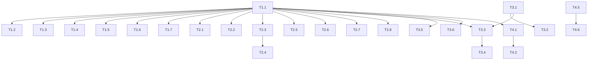

# Desktop app plan: Screaming Frog parity and optimization

This plan drives the unattended agent harness (`/gseo-run M<n>`). Each milestone file lists tasks an implementer agent builds on its own branch, a verifier agent re-checks, and a reviewer agent reviews before the orchestrator merges into local `staging`.

Scope: the desktop app only (`src/`, `src-tauri/`). Goal: close the audit gap with Screaming Frog SEO Spider for everything that does not need a paid external API, then optimize the app for large crawls.

## 1. Conventions

- **Branch:** `task/<id>-<slug>` from an up-to-date `staging`, for example `task/T1.2-url-audits`.
- **Commits:** Conventional Commits (`feat:`, `fix:`, `test:`, `refactor:`, `docs:`, `chore:`, `perf:`), one per plan step where practical. Never push.
- **Precedence:** this plan, then `CLAUDE.md`, then the `gseo-*` skills, then external skills. Where the plan is silent, pick the simplest option and note it in the task's final report.
- **Gate:** `node scripts/harness/gate.mjs --full` must print a final JSON line with `"ok":true` before a task is reported DONE. It runs `npx tsc --noEmit`, `npm test`, `npm run build`, `cargo fmt --check`, `cargo clippy --all-targets -- -D warnings` and `cargo test` (the Rust steps with `--manifest-path src-tauri/Cargo.toml`).

## 2. Architecture rules every task follows

1. **Rust collects raw signals only.** Anything that decides "this is an issue" lives in `src/lib/filters.ts`. A task that needs a new signal adds a field to `PageResult` or `ResourceResult` in `src-tauri/src/crawler/types.rs`; a task that can derive the issue from data already crawled touches only the frontend.
2. **New serialized fields are `#[serde(default)]`** so crawls saved by older versions still load, and they are mirrored in `src/types.ts` with the camelCase name.
3. **Every new filter** gets: a `FilterKey` member, an entry in the issue registry (created by T1.1), an entry in `src/lib/issueSolutions.ts` (title, problem, fix, source link to Google Search Central, MDN, web.dev or W3C), and a unit test in `src/lib/filters.test.ts` using the existing `makePage` factory (one test that triggers it, one that does not).
4. **Fixture rule.** Every task that adds or changes an audit signal adds a page (or server route) to the fixture site `src-tauri/tests/fixtures/site/` that triggers it, adds a row to `src-tauri/tests/fixtures/README.md`, and asserts the raw field in `src-tauri/src/crawler/fixture_tests.rs`. If the page is linked from `index.html`, update the expected URL list in `crawls_every_linked_page_exactly_once` and the `internal_link_count` assertion for the home page in `extracts_on_page_signals`.
5. **CSV export:** new `PageResult` columns are added to `export_pages_csv` in `src-tauri/src/export.rs` (header and row in the same position).
6. **No new dependency** (npm or crate) unless the task names it. Tasks that name one say why.
7. **No em dashes** in any user-visible string (labels, solutions, tooltips).

## 3. Milestones

| Milestone | File | Theme |
| --- | --- | --- |
| M1 | `M1-derived-audits.md` | Issue registry, then audits derived purely from data already crawled (frontend only, lowest risk) |
| M2 | `M2-new-signals.md` | New raw signals collected by the Rust crawler, with their filters |
| M3 | `M3-workflows.md` | Larger workflows: include/exclude, list mode, custom search and extraction, crawl comparison, raw vs rendered |
| M4 | `M4-optimization.md` | Code structure and performance for large crawls |

## 4. Tasks

| Task | Title | Depends on |
| --- | --- | --- |
| T1.1 | Single issue registry for filters and Overview counts | none |
| T1.2 | URL structure audits | T1.1 |
| T1.3 | Title and meta description length, pixel width and duplication with H1 | T1.1 |
| T1.4 | Directive and canonical audits | T1.1 |
| T1.5 | Sitemap audits | T1.1 |
| T1.6 | Content, depth, size and redirect target audits | T1.1 |
| T1.7 | Bulk issues export | T1.1 |
| T2.1 | Heading outline: H2s, H1 values and heading order | T1.1 |
| T2.2 | Multiple titles, multiple meta descriptions, meta refresh and pagination links | T1.1 |
| T2.3 | Internal outlinks with anchor text and rel attributes | T1.1 |
| T2.4 | Link analysis: inlinks, link score, anchor audits | T2.3 |
| T2.5 | Security headers and mixed content | T1.1 |
| T2.6 | Hreflang pairs and return-link validation | T1.1 |
| T2.7 | Image size and missing dimensions | T1.1 |
| T2.8 | Near-duplicate content via simhash | T1.1 |
| T3.1 | Include and exclude URL patterns | none |
| T3.2 | List mode: crawl a pasted list of URLs | T3.1 |
| T3.3 | Custom search | T1.1, T3.1 |
| T3.4 | Custom extraction with CSS selectors | T3.3 |
| T3.5 | Crawl comparison between two saved crawls | T1.1 |
| T3.6 | Raw HTML vs rendered HTML comparison | T1.1 |
| T4.1 | Split App.tsx into columns, event hook and session hook | T1.1 |
| T4.2 | Incremental derived state and Overview counts | T4.1 |
| T4.3 | Throttle crawl progress events | none |
| T4.4 | Stream saved crawls instead of cloning and pretty-printing | none |
| T4.5 | Synthetic large-site fixture and crawl throughput budget | none |
| T4.6 | Reuse the start page response for site info | T4.5 |

## 5. Dependency graph

## 6. Out of scope

Anything needing a paid or keyed external API (PageSpeed Insights, Search Console, Ahrefs, Majestic, GA), spelling and grammar checks, and scheduling. Revisit after M4.
